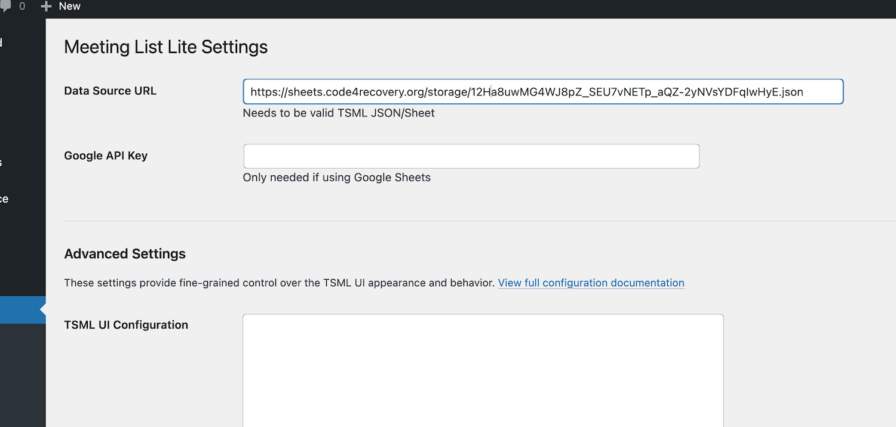
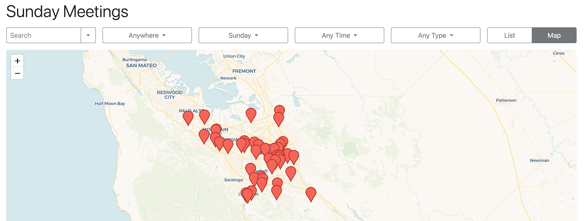

# Meeting List Lite

A streamlined WordPress plugin for displaying 12-step meeting information when your meeting data is maintained elsewhere.

[](https://wordpress.org/plugins/meeting-list-lite/)
[](https://www.php.net/)
[](http://www.gnu.org/licenses/gpl-2.0.html)

## Overview

Meeting List Lite is a streamlined solution for displaying 12-step meeting information on your WordPress site when your meeting data is maintained elsewhere. Unlike the full 12 Step Meeting List plugin, this "lite" version doesn't include a database or editing capabilities—it simply displays meetings from your existing data source.

## Perfect For

Service bodies who:
- Maintain their meeting data in a Google Sheet, JSON feed, or another system
- Don't need to edit meeting information within WordPress
- Want the familiar TSML UI interface without the overhead of data management
- Already have geocoded meeting data (latitude/longitude for in-person meetings)

## Key Features

- **TSML UI Integration**: Displays meetings using the same TSML UI interface as 12 Step Meeting List
- **Multiple Data Sources**: Supports JSON feeds and Google Sheets that follow the [TSML spec](https://github.com/code4recovery/spec)
- **No Database Required**: Your data source is the single source of truth
- **Lightweight**: Easy to set up with minimal overhead
- **TSML Compatible**: Fully compatible with the TSML data format

## Requirements

- **WordPress**: 6.8 or higher (tested up to)
- **PHP**: 8.0 or higher
- **Data Source**: Must follow the [TSML specification](https://github.com/code4recovery/spec)
- **Geocoding**: For in-person meetings, latitude and longitude coordinates must already be included in your data (this plugin does not perform geocoding)

## Installation

1. Upload the `meeting-list-lite` directory to the `/wp-content/plugins/` directory
2. Activate the plugin through the 'Plugins' menu in WordPress
3. Go to **Settings → Meeting List Lite** and configure your data source URL
4. Add the `[tsml_ui]` shortcode to any WordPress page or post where you want meetings displayed

## Usage

### Basic Shortcode
```
[tsml_ui]
```

### Shortcode with Custom Data Source
```
[tsml_ui data_source="https://your-url.com/meetings.json"]
```

## Screenshots




## Frequently Asked Questions

<details>
<summary>What's the difference between this and 12 Step Meeting List?</summary>

12 Step Meeting List is a full-featured plugin that stores meeting data in your WordPress database and includes editing capabilities, geocoding, and data management tools. Meeting List Lite is designed for service bodies who maintain their meeting data elsewhere and just need to display it on their WordPress site.
</details>

<details>
<summary>What data formats are supported?</summary>

The plugin supports JSON feeds and Google Sheets that conform to the [TSML specification](https://github.com/code4recovery/spec).
</details>

<details>
<summary>Does this plugin geocode addresses?</summary>

No. Your data source must already include latitude and longitude coordinates for in-person meetings. If you need geocoding, consider using the full 12 Step Meeting List plugin instead.
</details>

<details>
<summary>Can I edit meeting data in WordPress?</summary>

No. This is a display-only plugin. Your data source (JSON feed, Google Sheet, etc.) is the single source of truth. To edit meetings, update your external data source.
</details>

<details>
<summary>Where do I configure my data source?</summary>

Go to **Settings → Meeting List Lite** in your WordPress dashboard, or use the `data_source` attribute in your shortcode.
</details>

## External Services

This plugin relies on external services to function properly:

### TSML UI React Component

- **Service**: Code4Recovery TSML UI (tsml-ui.code4recovery.org)
- **Purpose**: Provides the JavaScript React component that renders the meeting list interface
- **Data sent**: No user data is transmitted to this service. The plugin only loads the JavaScript library
- **When**: The script is loaded whenever a page contains the `[tsml_ui]` shortcode
- **Terms of use**: [GitHub License](https://github.com/code4recovery/tsml-ui/blob/main/LICENSE)
- **Privacy policy**: [Code4Recovery Privacy Policy](https://code4recovery.org/privacy/)

### Your Data Source

- You must configure your own data source URL (JSON feed or Google Sheet) in the plugin settings
- The plugin fetches meeting data from this URL to display on your site
- No data is sent to your data source; the plugin only reads from it

## Changelog

### 1.0.1

- Support for JSON and Google Sheet data sources
- TSML UI integration for meeting display
- Shortcode support with configurable attributes

### 1.0.0

- Initial Release

## Links

- [WordPress Plugin Directory](https://wordpress.org/plugins/meeting-list-lite/)
- [TSML Specification](https://github.com/code4recovery/spec)

## License

This plugin is licensed under the [GPLv2 or later](http://www.gnu.org/licenses/gpl-2.0.html).

## Contributors

- [pjaudiomv](https://github.com/pjaudiomv)
